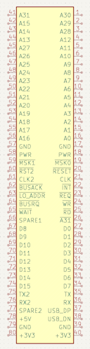
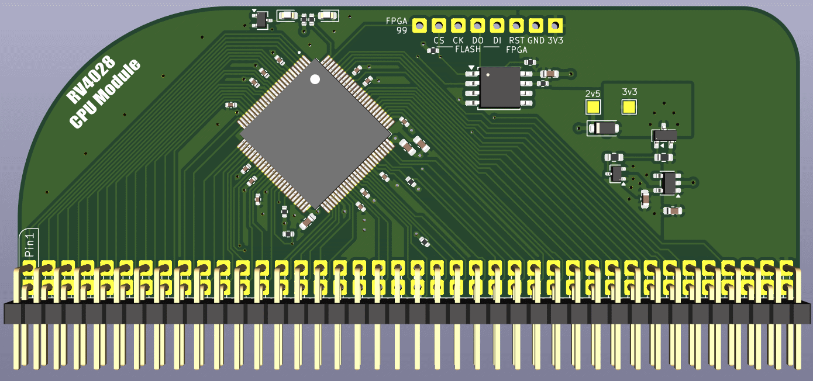

# RV4028 - A hackable Risc-V computer

RV4028 is intended as a Risc-V equivalent of the excellent [RC2014 Z80](https://rc2014.co.uk/) homebrew computer.

The idea is to create a minimal Risc-V system that is easy to understand and extend.

The inspiration for this came from [@theJPster](https://github.com/thejpster)'s [post](https://bsky.app/profile/thejpster.org.uk/post/3m3ngtx5sfc2i).

All hardware and software will be open source and permissively licensed.

## Architecture

The system bus has a 32-bit address and 16-bit data, which fits reasonably well with an RV32 system and readily available (P)SRAM chips, and runs at 3.3V.

Modules are attached by an 80-pin dual row header, similar to RC2014 modules but with 2 rows of pins instead of 1.  2mm pitch headers are used instead of 2.54mm, this makes boards slightly smaller (and cheaper), and also avoids the possibility of boards being plugged into RC2014 by mistake.

However, the pinout is chosen such that RC2014 modules might be compatible, if 3v3 capable components are used and a backplane with additional 2.54mm pitch sockets were created.  The pinout is also chosen such that modules not requiring access to the full bus can use just a single row.

## Software

The intention is to be able to run standard RV32I programs with a C SDK.  A Micropython port and Rust support are likely.

It is currently not a goal to support either real time operating systems (although this may be possible in future), or Linux (which would likely not be possible without moving to a larger FPGA).

# Initial modules

## CPU

Keeping things minimal and simple, we use a Bruno Levy's [FemtoRV](https://github.com/BrunoLevy/learn-fpga/tree/master/FemtoRV) Quark (RV32I) core with some small modifications, and a wrapper to handle breaking each 32-bit data access into 16-bit accesses.  This is the most minimal Risc-V instruction set and can fit in a small FPGA, so we use an ICE40 [HX1K](https://www.latticesemi.com/ice40), which is available in a 100-pin QFP.

A small flash is required for the FPGA configuration, a header will be provided that will allow the FPGA to be held in reset and the flash programmed.  Although it is significantly larger than required, using a 1MB [W25Q80DV](https://www.lcsc.com/datasheet/C14086.pdf) seems cost effective. 

[Schematic](cpu/cpu.pdf)

## RAM

The two candidates here are PSRAM, such as the [IS66WVE](https://www.lcsc.com/datasheet/C1350157.pdf), or SRAM such as the [CY7C1041G30](https://www.lcsc.com/datasheet/C2944680.pdf).

The PSRAM is larger but slower, and the larger capacities only seem available in BGA packages.  The linked SRAM is available in TSOP, which may allow for easier assembly.

[Schematic](ram/ram.pdf)

## ROM

Something like [SST39VF3202C](https://www.lcsc.com/datasheet/C637403.pdf) looks suitable, and available at the same access speed as the PSRAM (70ns).

ROM might not be required - we can embed a small amount of ROM (6kB) in the CPU gateware which could be enough for a simple SD card driver, allowing a program to be loaded from SD card to RAM without any ROM.

## IO

An [RP2350B](https://datasheets.raspberrypi.com/rp2350/rp2350-datasheet.pdf) is used for IO.  The board should include:
- Two UARTs
- Two I2C broken out to Qw/ST compatible ports
- A micro SD card socket
- An SPI with a couple of chip selects (this should be made easy to connect to the CPU for updating the gateware)
- Some GPIO

8 bits of address should easily be sufficient, and 8 bits of data should also be fine, which allows this to be single row.

I'm tempted to put USB on a couple of the spare backplane pins, so a single USB connection can power the system and be used to communicate with/program the RP2350.

If we also wired clock and reset from the RP2350 then it could provide a clock, meaning a separate clock module would not be required.

[Schematic](io/io.pdf) | [More details](io/README.md)

## Clock

As above, a clock module likely won't be required, but it is a nice educational addition, and would allow the machine to be used without the RP2350 based IO module.

A 14.7456MHz crystal would seem appropriate - double the clock rate of the RC2014.  Assuming IS66WVE PSRAM is used, the maximum reliable clock rate of the system should be around 17-18MHz (TBC).

An [SN74LVC1GX04](https://www.lcsc.com/datasheet/C2653063.pdf) could be used to drive the crystal.

## Backplane

USB-C socket, with data wired to spare pins for RP2350 on IO board.

AP2112K for 3.3V supply.  3v3 enable is delayed by a few milliseconds to help with power sequencing on the CPU board (the core power to the FPGA should be applied before IO voltage).

Decoupling caps, LED, reset button.  Use surface mount headers for the 2x40 pin connectors, allows all the signals to run above a nice unbroken ground plane, rather than having loads of through holes breaking up the ground planes.

# Bus timing

Addresses are always 16-bit aligned and a byte mask is used for single byte stores.

All writes complete in a two cycles.  Reads normally complete in two cycles, but wait may be asserted to extend the read cycle.

MREQ is intended to be wired to the (P)SRAM CE, so must be pulsed regularly even if reads are continuous in order to avoid exceeding max CE assertion time on PSRAM.  This is acheived by pulsing it high in the first half clock of each read cycle.  MREQ remains low at the start of a write cycle in order to support a faster clock speed when used with a IS66WVE.

IORQ is not required as the address space is sufficiently large.  It is simply set to ~A31.

LO_ADDR indicates if the address is in the bottom 16MB of the address space, to reduce the amount of address checking logic required on low addressed modules.

## Expected RAM implementation

RAM access is controlled by CE, OE, WE and byte selects.

* Address high bits are compared for the chip, CE is never asserted if the address doesn't match
* CE is MREQ
* WE is WR
* OE is RD
* Byte selects are MSK.

Writes are latched by deasserting WE and CE.  So a full store instruction that read the instruction and wrote data back to the same RAM chip would look like:

